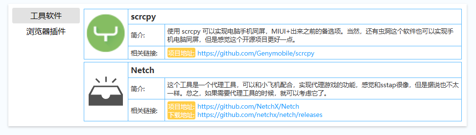

纯前端页面，维护一个json文件即可，html和js负责渲染，可以对接到github pages和博客园作为弹窗

Json文件结构

+ 独立版

左侧为分类tab，右侧为条目列表，条目列表中是卡片，其中有对应信息

+ 弹窗版

左侧为分类tab，右侧为条目列表，只有名字简介和下载链接

## 增加条目
**不建议**使用相对路径，因为可能会出现`html`文件和`data.json`不同源的情况，可以考虑把图标转`base64`

## 测试

使用`python -m http.server`在根目录执行即可启动一个`http服务器`，因为用到了异步请求，所以必须用`http服务器`才能正常使用